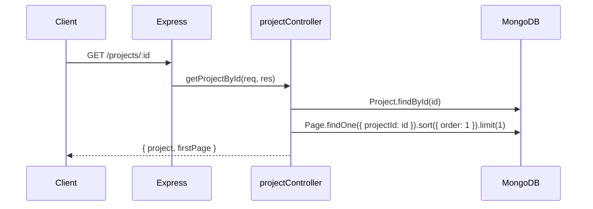

# Design Document — Project with First Page

## Overview

Modify `GET /projects/:id` to return the project document alongside its first page (the page with the lowest `order` value). The change is scoped to `projectController.ts` and a new `projectRoutes.ts`. No new models or services are needed.

## Architecture

The feature touches three layers:

1. `projectController.ts` — update `getProjectById` to also query the first page.
2. `projectRoutes.ts` (new file) — wire the project controller to Express routes, mirroring the pattern used by `pageRoutes.ts` and `groupRoutes.ts`.
3. `server.ts` — register the new `/projects` route.



## Components and Interfaces

### `getProjectById` (updated)

Runs two queries in parallel using `Promise.all` for performance:

```ts
const [project, firstPage] = await Promise.all([
  Project.findById(id),
  // To load ALL pages later: remove .limit(1) or move to a separate endpoint
  Page.findOne({ projectId: id }).sort({ order: 1 }).limit(1)
]);
```

Returns:
```json
{
  "project": { ...projectFields },
  "firstPage": { ...pageFields } | null
}
```

### `projectRoutes.ts` (new)

Follows the same pattern as `pageRoutes.ts` and `groupRoutes.ts`:

```ts
router.post("/", createProject);
router.get("/", getProjectsByUserId);
router.get("/ungrouped", getUngroupedProjectsByUserId);
router.get("/group/:groupId", getProjectsByGroupId);
router.get("/:id", getProjectById);
router.put("/:id", updateProject);
router.delete("/:id", deleteProject);
```

### `server.ts` (updated)

Add:
```ts
import projectRoutes from './routes/projectRoutes.ts';
app.use('/projects', projectRoutes);
```

## Data Models

No schema changes. The existing `Page` model already has:
- `projectId` — reference to `Project`
- `order` — required Number
- Compound index `{ projectId: 1, order: 1 }` — used by the `.sort({ order: 1 }).limit(1)` query, making it efficient.

## Error Handling

| Scenario | Response |
|---|---|
| Project not found | `404 { error: 'Project not found' }` |
| Project found, no pages | `200 { project: {...}, firstPage: null }` |
| DB error | `500 { error: message }` |

## Testing Strategy

- Unit: mock `Project.findById` and `Page.findOne` to verify parallel execution and response shape.
- Integration: seed a project with multiple pages at different `order` values and assert the response returns the one with the lowest `order`.
- Edge case: project with zero pages should return `firstPage: null`.
